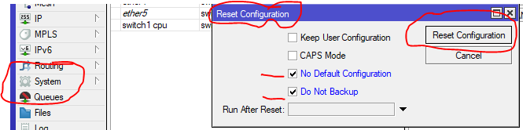

# LAB-3
tanggal 12 agustus 2025
# Blank Configuration di Mikrotik 

  Ada beberapa cara untuk mendapatkan blank configuration mikrotik, salah satunya yaitu dengan **Reset Configuration**.via winbox  
  1.Reset configuration   

  a. Yang pertama klik system  
  b. Pilih reset configuration   
  c. lalu ceklis **no default configuration** dan **do not backup**  
  d. setelah itu klik reset configuration

 Blank configuration mikrotik merupakan mikrotik yang belum dikonfigurasi , atau masih kosong
 konfigurasi nya.untuk mengakses mikrotik yang sudah di blank kan ini kita bisa mengakses melalui ether1.  
 Dan kita harus mengunakan MACAddress untuk login, karna Mikrotik belum memiliki IP.

 #kesimpulan 
 blak configuration sangat cocok bagi yang mau belajar dari awal tentang mikrotik.
    
